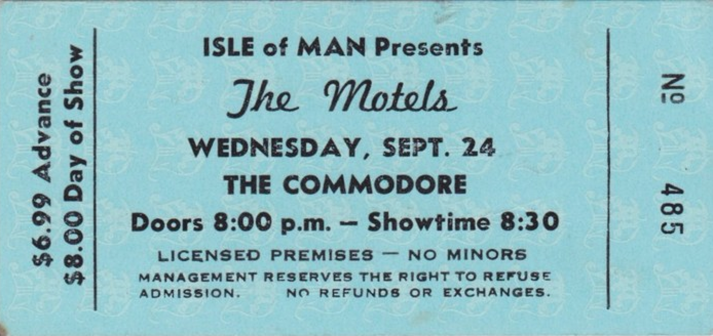

# [Vorname Name, Projekttitel](../index.md)

Digital Typography 2017

## 5. Details

* 5.1 [Schriften](#schriften)
* 5.2 [Farben](#farben)
* 5.3 [Style Tiles](#tiles)
* 5.4 [Andere](#andere)

###  5.1 Schriften [&uarr;](#top)

Beschriftung des obigen Bildes

Beschriftung des obigen Bildes

###  5.2 Farben [&uarr;](#top)

Beschriftung des obigen Bildes

Beschriftung des obigen Bildes

###  5.3 Style Tiles [&uarr;](#top)

Beschriftung des obigen Bildes

Beschriftung des obigen Bildes

###  5.4 Andere [&uarr;](#top)

Beschriftung des obigen Bildes

Beschriftung des obigen Bildes
